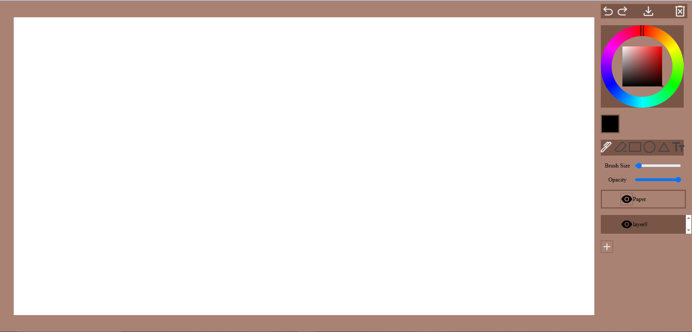
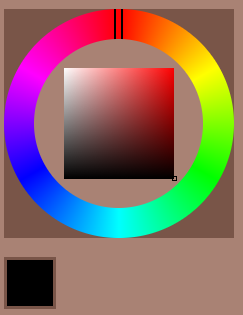
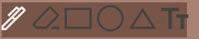
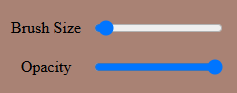
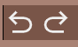
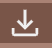
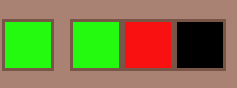
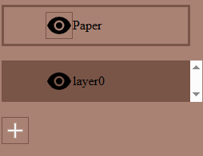

# Software Studio 2025 Spring
## Assignment 01 Web Canvas

### Scoring

| **Basic components** | **Score** | **Check** |
| :------------------- | :-------: | :-------: |
| Basic control tools  |    30%    |     Y     |
| Text input           |    10%    |     Y     |
| Cursor icon          |    10%    |     Y     |
| Refresh button       |    5%     |     Y     |

| **Advanced tools**     | **Score** | **Check** |
| :--------------------- | :-------: | :-------: |
| Different brush shapes |    15%    |     Y     |
| Un/Re-do button        |    10%    |     Y     |
| Image tool             |    5%     |     Y     |
| Download               |    5%     |     Y     |

| **Other useful widgets** | **Score** | **Check** |
| :----------------------- | :-------: | :-------: |
| Color History            |   1~5%    |     Y     |
| Layer System             |   1~5%    |     Y     |

---

### How to use 
The whole website looks like this.
    
    * Palette
        
        The color system is HSL.
        You can control the hue by outer ring and control saturation and lightness, just click and drag indicator on them.(it sometime stucked because of the not draggable event of the browser triggered, just release your mouse and click again then.)
        And the color you picked will displayed in the block below.

* Tools
        
        Just click at the tool icon to select tool to use.
        Selected tool will be highlighted.
        
        As the text says, this two sliders are each used to control size and opacity of the tool.
        The brush size controls line width of pen and geometric tools, and size of text tools at the same time.
        * Pen
            Just a pen, draw by holding and moving your mouse around in the canvas area.
        * Eraser
            Just a eraser, erase by holding and moving your mouse around in the canvas area.
        * Rectangle / Ellipse / Triangle
            Just geometric shapes, control the diagonal by holding and moving your mouse in the canvas area after click down, and the shape will be drawn when mouse released.
        * Text
            Click in the canvas area will set the left align point of text, and it will start listening your keyboard input, just type and the content will shows up, also you can delete things you typed wrong before you comfirmed it by pressing ENTER, or just abandon the whole content you inputed this time by escape typing mode by pressing ESC.
            You need to press ENTER to comfire your input, or once you use other tool or click other position, the input this time will be seen as abandond just like you pressed ESC

    * Redo/Undo
        
        Just click the button, the left one is UNDO, and the right one is REDO, and it will resume the corresponding state of canvas.

    * Download Image
         
        Just click the button, then it will turns the currently "displayed"(this is controlled by my bonus function, layer system, if you haven't done any thing by that, its effect must be the same as download the whole canvas as a pn file) canvas into a png image and download it.
    
    * Upload Image
        Just drag a image into the canvas area from your file explorer, and it will appear in the canvas with your mouse position as center.

    * Refresh
        
        Just click the button, and it will clear the content of "currently selected layer"(this is controlled by my bonus function, layer system, if you haven't done any thing by that, its effect must be the same as clear the whole canvas)
    

### Bonus Function description
* Color history, I think no one is a human outlook color calibrator here
        
        Last three color you used will be stored beside the picked color, you can reuse them just by clicking on them to set the picked color back.
        A color already in the history won't be stored again.

* Layer system, a really necessary function for a painting app.
        
        You can create new layer by click the add button below.
        Switch between them is by clicking at them in the list, and the currently selected layer will have different background color in the list to make it identifiable.
        All changes you make on the canvas area is to "the layer", including undo, redo and clear.
        And you can toggle each layers visibility by the eye button on their list item.
        When a layer is invisible, it won't appear in the downloaded image, but it is acctually still exist and can be editted even you cannot see it.
        (The paper layer is special, it cannot be editted, make it invisible can make downloaded image havs transparent background.)

### Web page link

Oak Paint[https://oakpaint.web.app/]

### Others (Optional)

Please don't order a fried rice in the bar.

